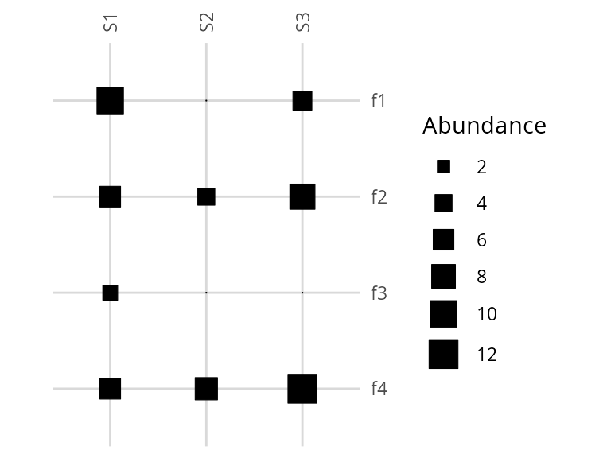
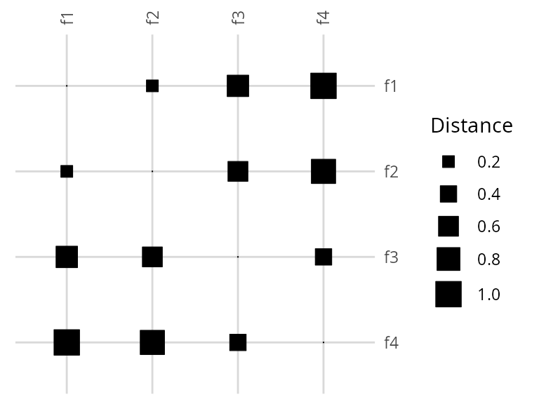
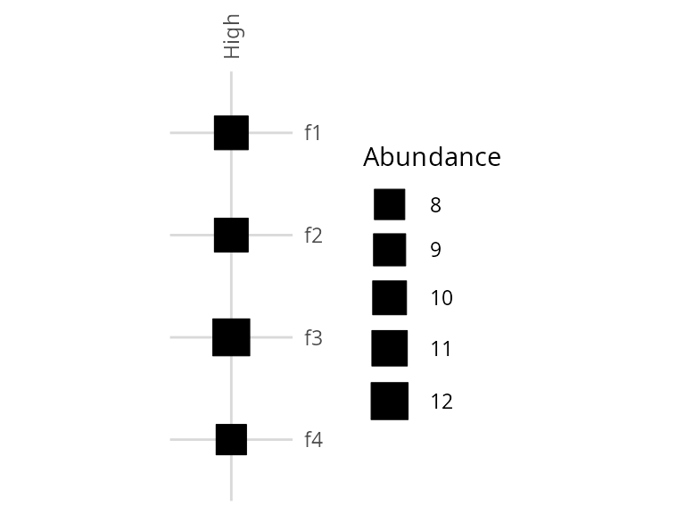
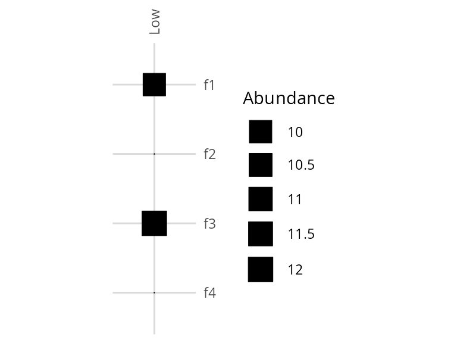
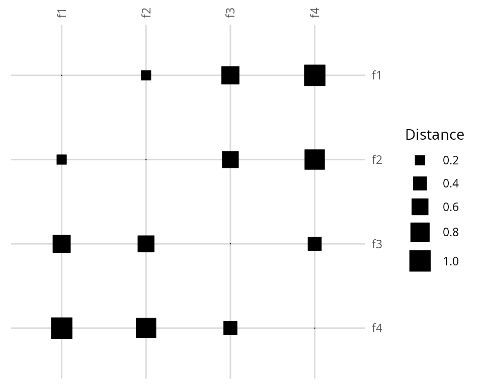

# Introduction to divermeta

## Introduction

`divermeta` computes multiplicity, the metric that quantifies
within‑cluster diversity that is typically neglected when elements are
grouped into units (e.g., genes into homolog groups, ASVs into OTUs,
etc.).

The core funcion of the package is
[`divermeta()`](https://mycology-microbiology-center.github.io/divermeta/reference/divermeta.md),
which computes multiple indices across all samples at once. You may
request the following indices via `indices` argument:

- inventory multiplicity: `"multiplicity_inventory"`
- distance‑based multiplicity (σ‑capped): `"multiplicity_distance"`
- optional companions: `"raoQ"`, `"FD_sigma"`, `"FD_q"`, `"redundancy"`

Additionally, the package provides
[`metagenomic.alpha.index()`](https://mycology-microbiology-center.github.io/divermeta/reference/metagenomic.alpha.index.md)
(MAD) as a standalone function for computing the Metagenomic
Alpha-Diversity Index (see below).

This vignette uses tiny synthetic data to keep runtime short and outputs
deterministic.

## Installation

You can install the development version of divermeta from GitHub with:

``` r
# install.packages("remotes")
remotes::install_github("Mycology-Microbiology-Center/divermeta")
```

Load the package:

``` r
library(divermeta)
```

## Quick start

We create a small features x samples abundance matrix, a cluster
membership vector aligned by feature names, and a feature dissimilarity
matrix in the 0-1 range.

``` r
# Features (rows) and samples (columns)
features <- c("f1", "f2", "f3", "f4")
samples  <- c("S1", "S2", "S3")

abund <- matrix(
  c(
    10,  4,  0,  # f1
     0,  9,  6,  # f2
     5,  3,  7,  # f3
     6,  0, 12   # f4
  ),
  nrow = length(features), byrow = TRUE,
  dimnames = list(features, samples)
)

# Clusters per feature (named, aligned to rownames(abund))
clusters <- c(f1 = "A", f2 = "A", f3 = "B", f4 = "B")

# Optional dissimilarity among features (0-1); names must match abund rownames
diss <- matrix(
  c(
    0.0, 0.2, 0.7, 1.0,
    0.2, 0.0, 0.6, 0.9,
    0.7, 0.6, 0.0, 0.4,
    1.0, 0.9, 0.4, 0.0
  ),
  nrow = length(features), byrow = TRUE,
  dimnames = list(features, features)
)

# One call computes multiple indices across all samples
res <- divermeta(
  abund,
  clusters = clusters,
  diss     = diss,
  q        = 1,
  sig      = 0.8,
  indices  = c("multiplicity_inventory", "multiplicity_distance", "raoQ", "redundancy"))
res
#>   Sample multiplicity_inventory multiplicity_distance      raoQ redundancy
#> 1     S1               1.434634              1.085995 0.4852608  0.1496599
#> 2     S2               1.651211              1.008499 0.2484375  0.3375000
#> 3     S3               1.648991              1.188623 0.3955200  0.2380800
```

Columns correspond to requested indices; rows correspond to samples.
Inventory multiplicity reflects the average within‑cluster diversity;
distance‑based multiplicity reflects average within‑cluster functional
or phylogenetic diversity with distances capped at a threshold sigma
(`σ`).

You can visualize the input data structures side-by-side:

``` r
visualize_abundance(abund, csize = 0.7, clegend = 0.4)
visualize_dist(diss, csize = 0.7, clegend = 0.4)
```



The left plot shows the abundance matrix (features x samples), where
tile size represents abundance magnitude. The right plot shows the
distance matrix (pairwise distances between features), where tile size
represents distance magnitude. Features f1-f2 belong to cluster A, and
f3-f4 belong to cluster B. Notice how within-cluster distances (f1-f2,
f3-f4) are smaller than between-cluster distances.

## About multiplicity index

TODO - brief intro + figure 1 & 2 (a bit reworked)

Here we illustrate the multiplicity index concept using two samples with
the same cluster structure:

- High: multiple subunits per cluster (higher within‑cluster diversity)
- Low: only one representative per cluster (lower within‑cluster
  diversity)

``` r
# Reuse `features` and `clusters` from above
abund_concept <- matrix(
  c(
    10, 10,  # f1 (A, representative)
    10,  0,  # f2 (A, additional subunit present only in High)
    12, 12,  # f3 (B, representative)
     8,  0   # f4 (B, additional subunit present only in High)
  ),
  nrow = length(features), byrow = TRUE,
  dimnames = list(features, c("High","Low")) )

concept_res <- divermeta(
  abund_concept,
  clusters = clusters,
  indices  = "multiplicity_inventory",
  q        = 1)

concept_res
#>   Sample multiplicity_inventory
#> 1   High               1.979966
#> 2    Low               1.000000
```

As expected, `High` shows a larger multiplicity value than `Low`, since
each cluster contains more distinct subunits.

Visualizing the abundance matrices side-by-side helps illustrate the
difference:

``` r
visualize_abundance(abund_concept[, "High", drop = FALSE], 
                    sample.labels = "High multiplicity",
                    csize = 0.8, clegend = 0.5)
visualize_abundance(abund_concept[, "Low", drop = FALSE], 
                    sample.labels = "Low multiplicity",
                    csize = 0.8, clegend = 0.5)
```



In the **High** scenario (left), both clusters (A: f1+f2, B: f3+f4)
contain multiple distinct features with non-zero abundances, resulting
in higher multiplicity. In the **Low** scenario (right), each cluster
effectively contains only one feature (f2 and f4 have zero abundance),
resulting in lower multiplicity. The tile size represents abundance
magnitude.

### Inventory multiplicity

``` r
res_q0 <- divermeta(
  abund,
  clusters = clusters,
  indices  = "multiplicity_inventory",
  q        = 0)

res_q1 <- divermeta(
  abund,
  clusters = clusters,
  indices  = "multiplicity_inventory",
  q        = 1)

res_q2 <- divermeta(
  abund,
  clusters = clusters,
  indices  = "multiplicity_inventory",
  q        = 2)

cbind(
  Sample = res_q1$Sample,
  M_q0   = res_q0$multiplicity_inventory,
  M_q1   = res_q1$multiplicity_inventory,
  M_q2   = res_q2$multiplicity_inventory)
#>      Sample M_q0  M_q1               M_q2              
#> [1,] "S1"   "1.5" "1.43463376571196" "1.37267080745342"
#> [2,] "S2"   "1.5" "1.65121096664765" "1.67924528301887"
#> [3,] "S3"   "1.5" "1.64899100795382" "1.73362445414847"
```

`q` controls abundance weighting (0 richness‑like, 1 Shannon‑type, 2
Simpson‑type). Higher `q` down‑weights rare subunits.

### Distance‑based multiplicity

Distance‑based multiplicity requires a dissimilarity matrix and uses
Shannon‑type weighting. Use `sig` to cap pairwise distances and define
when two subunits are considered distinct.

The distance matrix structure is key to understanding distance-based
multiplicity. Here’s the distance matrix from our example:

``` r
visualize_dist(diss, csize = 0.8, clegend = 0.5)
```



Notice how features within the same cluster (f1-f2 in cluster A, f3-f4
in cluster B) have smaller distances (smaller squares) compared to
distances between clusters. Distance-based multiplicity quantifies the
diversity within clusters while accounting for these
functional/phylogenetic similarities.

``` r
res_sig08 <- divermeta(
  abund,
  clusters = clusters,
  diss     = diss,
  indices  = "multiplicity_distance",
  sig      = 0.8)

res_sig10 <- divermeta(
  abund,
  clusters = clusters,
  diss     = diss,
  indices  = "multiplicity_distance",
  sig      = 1.0)

merge(res_sig08, res_sig10, by = "Sample", suffixes = c("_sig0.8","_sig1.0"))
#>   Sample multiplicity_distance_sig0.8 multiplicity_distance_sig1.0
#> 1     S1                     1.085995                    0.9735683
#> 2     S2                     1.008499                    0.9251559
#> 3     S3                     1.188623                    1.0508205
```

Smaller `sig` trims large distances, making subunits more similar and
lowering functional/phylogenetic diversity; this typically increases
distance‑based multiplicity (less diversity lost to clustering,
relatively more within‑cluster similarity accounted for).

### Metagenomic Alpha-Diversity Index (MAD)

The Metagenomic Alpha-Diversity Index (MAD) is another metric for
measuring within-cluster diversity. Unlike multiplicity indices, MAD
does not incorporate element abundances and decreases as cluster size
increases. It is available as a standalone function
[`metagenomic.alpha.index()`](https://mycology-microbiology-center.github.io/divermeta/reference/metagenomic.alpha.index.md):

``` r
# Compute MAD
# Note: MAD requires clusters and dissimilarity matrix, but doesn't use abundances
# Since it doesn't use abundances, the value is the same regardless of sample
mad_value <- metagenomic.alpha.index(
  clust = clusters,
  diss = diss
)
mad_value
#> [1] 0.575
```

**Note**: Unlike multiplicity, MAD does not account for element
abundances and behaves differently as cluster size increases. See the
manuscript for a detailed comparison between MAD and multiplicity
indices.

## Practical tips

- Ensure `clusters` is aligned to `rownames(abund)`; a named vector is
  the most robust.
- Provide `diss` scaled to 0-1. Values above `sig` are capped
  internally.
- Choose `q` to emphasize common vs. rare subunits; distance‑based
  multiplicity is fixed to Shannon‑type weighting.

## Importing data from third‑party tools (TODO)

TODO - add recipes on importing outputs from common pipelines/tools and
preparing data for
[`divermeta()`](https://mycology-microbiology-center.github.io/divermeta/reference/divermeta.md).

## Session info

``` r
sessionInfo()
#> R version 4.5.2 (2025-10-31)
#> Platform: x86_64-redhat-linux-gnu
#> Running under: Fedora Linux 43 (KDE Plasma Desktop Edition)
#> 
#> Matrix products: default
#> BLAS/LAPACK: FlexiBLAS OPENBLAS-OPENMP;  LAPACK version 3.12.1
#> 
#> locale:
#>  [1] LC_CTYPE=en_US.UTF-8    LC_NUMERIC=C            LC_TIME=C              
#>  [4] LC_COLLATE=en_US.UTF-8  LC_MONETARY=en_US.UTF-8 LC_MESSAGES=en_US.UTF-8
#>  [7] LC_PAPER=C              LC_NAME=C               LC_ADDRESS=C           
#> [10] LC_TELEPHONE=C          LC_MEASUREMENT=C        LC_IDENTIFICATION=C    
#> 
#> time zone: Europe/Tallinn
#> tzcode source: system (glibc)
#> 
#> attached base packages:
#> [1] stats     graphics  grDevices utils     datasets  methods   base     
#> 
#> other attached packages:
#> [1] divermeta_0.0.3
#> 
#> loaded via a namespace (and not attached):
#>  [1] vctrs_0.6.5        cli_3.6.5          knitr_1.50         rlang_1.1.6       
#>  [5] xfun_0.55          generics_0.1.4     S7_0.2.1           textshaping_1.0.4 
#>  [9] jsonlite_2.0.0     glue_1.8.0         htmltools_0.5.9    ragg_1.5.0        
#> [13] sass_0.4.10        scales_1.4.0       rmarkdown_2.30     grid_4.5.2        
#> [17] tibble_3.3.0       evaluate_1.0.5     jquerylib_0.1.4    fastmap_1.2.0     
#> [21] yaml_2.3.12        lifecycle_1.0.4    compiler_4.5.2     dplyr_1.1.4       
#> [25] RColorBrewer_1.1-3 fs_1.6.6           pkgconfig_2.0.3    htmlwidgets_1.6.4 
#> [29] rstudioapi_0.17.1  farver_2.1.2       systemfonts_1.3.1  digest_0.6.39     
#> [33] R6_2.6.1           tidyselect_1.2.1   pillar_1.11.1      magrittr_2.0.4    
#> [37] bslib_0.9.0        withr_3.0.2        tools_4.5.2        gtable_0.3.6      
#> [41] pkgdown_2.2.0      ggplot2_4.0.1      cachem_1.1.0       desc_1.4.3
```
