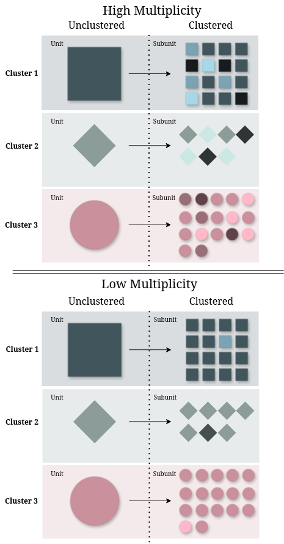
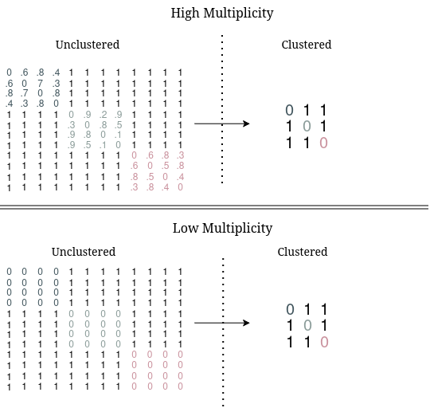

```{r, include = FALSE}
knitr::opts_chunk$set(
  collapse = TRUE,
  comment = "#>",
  fig.width = 7,
  fig.height = 5
)
set.seed(42)
```

## Introduction

`divermeta` computes multiplicity, the metric that quantifies within‑cluster diversity that is typically neglected when elements are grouped into units (e.g., genes into homolog groups, ASVs into OTUs, etc.).  

The core function of the package is `divermeta()`, which computes multiple indices across all samples at once. You may request the following indices via `indices` argument:

- inventory multiplicity: `"multiplicity_inventory"`
- distance‑based multiplicity (σ‑capped): `"multiplicity_distance"`
- optional companions: `"raoQ"`, `"FD_sigma"`, `"FD_q"`, `"redundancy"`
- averages over the clusters: relative multiplicity `"relative_multiplicity"` and average redundancy `"average_redundancy"`

Additionally, the package provides `metagenomic.alpha.index()` (MAD) as a standalone function for computing the Metagenomic Alpha-Diversity Index (see below).

This vignette uses tiny synthetic data to keep runtime short and outputs deterministic.

## Installation

You can install the development version of divermeta from GitHub with:

```{r eval=FALSE}
# install.packages("remotes")
remotes::install_github("Mycology-Microbiology-Center/divermeta")
```

Load the package:

```{r setup}
library(divermeta)
```

## Quick start

We create a small samples x features abundance table, a cluster membership vector named by feature, and a table of pairwise feature dissimilarities in the 0-1 range (one row per pair of features).

```{r}
# Samples (rows) and features (columns)
features <- c("f1", "f2", "f3", "f4")
samples  <- c("S1", "S2", "S3")

abund <- matrix(
  c(
    10, 0, 5,  6,  # S1
     4, 9, 3,  0,  # S2
     0, 6, 7, 12   # S3
  ),
  nrow = length(samples), byrow = TRUE,
  dimnames = list(samples, features)
)

# Clusters per feature (named by the column names of abund)
clust <- c(f1 = "A", f2 = "A", f3 = "B", f4 = "B")

# Optional dissimilarities among features (0-1): id_1, id_2, distance
diss <- data.frame(
  ID1      = c("f1", "f1", "f1", "f2", "f2", "f3"),
  ID2      = c("f2", "f3", "f4", "f3", "f4", "f4"),
  Distance = c(0.2,  0.7,  1.0,  0.6,  0.9,  0.4)
)

# One call computes multiple indices across all samples
res <- divermeta(
  abund,
  clust    = clust,
  diss     = diss,
  q        = 1,
  sig      = 0.8,
  indices  = c("multiplicity_inventory", "multiplicity_distance", "raoQ", "redundancy"))
res
```

Columns correspond to requested indices; rows correspond to samples. 
Inventory multiplicity reflects the average within‑cluster diversity; 
distance‑based multiplicity reflects average within‑cluster functional or phylogenetic diversity with distances capped at a threshold sigma (`σ`).

You can visualize the input data structures side-by-side (the plotting functions take the same `abund` and `diss` as the indices):

```{r fig.show='hold', out.width='50%', fig.width=4, fig.height=3}
visualize_abundance(abund, csize = 0.7, clegend = 0.4)
visualize_dist(diss, csize = 0.7, clegend = 0.4)
```

The left plot shows the abundance matrix (samples x features), where tile size represents abundance magnitude. The right plot shows the distance matrix (pairwise distances between features), where tile size represents distance magnitude. Features f1-f2 belong to cluster A, and f3-f4 belong to cluster B. Notice how within-cluster distances (f1-f2, f3-f4) are smaller than between-cluster distances.

## About multiplicity index


The multiplicity index is a diversity index designed specifically for metagenomic data, but that can be applied to other types of ecological data. In the context of clustering subunits (like strains, variants, or protein sequences) into their corresponding units (species, gene families, or homologous groups), *multiplicity* measures both the average intra-cluster diversity across all units and the diversity sacrificed by the chosen clustering scheme. After clustering and working directly with the obtained units, the underlying composition and diversity of each unit is masked by the clustering scheme. This index serves as a tool to distinguish if the resulting units have a single representative subunit inside of them or instead, are composed of several distinct subunits that cluster together into the unit. The following image gives a graphical representation of this scenario

```{r}

```

There are two versions of the index, a distance agnostic version (inventory multiplicity) and one that incorporated the notion of similarity / distance between the subunits into it's calculation (distance-based multiplicity). The case for low and hight distance-based multiplicity is graphically represented in the following figure using distance matrices among subunits (unclustered) and units (clustered)

```{r}

```

For more details, please refer to the accompanying publication.

Here we illustrate the multiplicity index concept using two samples with the same cluster structure:

- High: multiple subunits per cluster (higher within‑cluster diversity)
- Low: only one representative per cluster (lower within‑cluster diversity)

```{r}
# Reuse `features` and `clust` from above
# f1 and f3 are the representatives of clusters A and B; f2 and f4 are
# additional subunits present only in High
abund_concept <- matrix(
  c(
    10, 10, 12, 8,  # High
    10,  0, 12, 0   # Low
  ),
  nrow = 2, byrow = TRUE,
  dimnames = list(c("High","Low"), features) )

concept_res <- divermeta(
  abund_concept,
  clust    = clust,
  indices  = "multiplicity_inventory",
  q        = 1)

concept_res
```

As expected, `High` shows a larger multiplicity value than `Low`, since each cluster contains more distinct subunits.

Visualizing the abundance matrices side-by-side helps illustrate the difference:

```{r fig.show='hold', out.width='50%', fig.width=4, fig.height=3}
visualize_abundance(abund_concept["High", , drop = FALSE],
                    sample.labels = "High multiplicity",
                    csize = 0.8, clegend = 0.5)
visualize_abundance(abund_concept["Low", , drop = FALSE],
                    sample.labels = "Low multiplicity",
                    csize = 0.8, clegend = 0.5)
```

In the **High** scenario (left), both clusters (A: f1+f2, B: f3+f4) contain multiple distinct features with non-zero abundances, resulting in higher multiplicity. In the **Low** scenario (right), each cluster effectively contains only one feature (f2 and f4 have zero abundance), resulting in lower multiplicity. The tile size represents abundance magnitude.

### Inventory multiplicity

```{r}
res_q0 <- divermeta(
  abund,
  clust    = clust,
  indices  = "multiplicity_inventory",
  q        = 0)

res_q1 <- divermeta(
  abund,
  clust    = clust,
  indices  = "multiplicity_inventory",
  q        = 1)

res_q2 <- divermeta(
  abund,
  clust    = clust,
  indices  = "multiplicity_inventory",
  q        = 2)

cbind(
  Sample = res_q1$Sample,
  M_q0   = res_q0$multiplicity_inventory,
  M_q1   = res_q1$multiplicity_inventory,
  M_q2   = res_q2$multiplicity_inventory)
```

`q` controls abundance weighting (0 richness‑like, 1 Shannon‑type, 2 Simpson‑type). Higher `q` down‑weights rare subunits.

### Distance‑based multiplicity

Distance‑based multiplicity requires a dissimilarity table. Use `sig` to cap pairwise distances and define when two subunits are considered distinct.

The distance structure is key to understanding distance-based multiplicity. Here's the distance matrix from our example:

```{r fig.width=5, fig.height=4}
visualize_dist(diss, csize = 0.8, clegend = 0.5)
```

Notice how features within the same cluster (f1-f2 in cluster A, f3-f4 in cluster B) have smaller distances (smaller squares) compared to distances between clusters. Distance-based multiplicity quantifies the diversity within clusters while accounting for these functional/phylogenetic similarities.

```{r}
res_sig08 <- divermeta(
  abund,
  clust    = clust,
  diss     = diss,
  indices  = "multiplicity_distance",
  sig      = 0.8)

res_sig10 <- divermeta(
  abund,
  clust    = clust,
  diss     = diss,
  indices  = "multiplicity_distance",
  sig      = 1.0)

merge(res_sig08, res_sig10, by = "Sample", suffixes = c("_sig0.8","_sig1.0"))
```

Smaller `sig` trims large distances, making subunits more similar and lowering functional/phylogenetic diversity; this typically increases distance‑based multiplicity (less diversity lost to clustering, relatively more within‑cluster similarity accounted for).

### Metagenomic Alpha-Diversity Index (MAD)

The Metagenomic Alpha-Diversity Index (MAD) is another metric for measuring within-cluster diversity. Unlike multiplicity indices, MAD does not incorporate element abundances and decreases as cluster size increases. It is available as a standalone function `metagenomic.alpha.index()`, computed for every sample over the features present in it:

```{r}
# Compute MAD
# Note: MAD uses the abundances only to know which features are present in
# every sample; by default the first present feature of a cluster is its representative
mad_value <- metagenomic.alpha.index(
  abund = abund,
  diss  = diss,
  clust = clust
)
mad_value
```

**Note**: Unlike multiplicity, MAD does not account for element abundances and behaves differently as cluster size increases. See the manuscript for a detailed comparison between MAD and multiplicity indices.

## Large distance files

The number of pairs grows with the square of the number of features: 100 000 features give about 5·10⁹ pairs, far more than fits in memory. Every function that uses distances therefore also accepts `diss` as the **path to a file** with the three-column table. The file is read in chunks of `chunk_size` rows (default `1e6`), so memory depends on the number of samples, features and clusters and on `chunk_size`, not on the number of pairs. `divermeta()` computes all the requested indices from a single read of the file.

The file is delimited text with the two feature identifiers and the distance in its first three columns:

- `.csv` files are comma separated and `.tsv` files tab separated; for other extensions the separator (tab, comma or white space) is detected from the first line;
- the first line is expected to be a header (`header = TRUE`, the default); for files without a header, set `header = FALSE`. A first line that looks like data while a header is expected is an error, so no row is dropped silently;
- files may be compressed with gzip (`.gz`), bzip2 (`.bz2`), xz (`.xz`) or zstd (`.zst`, which needs the `zstd` command line tool).

We write the distances of the quick start to a compressed file and compute the same indices from it:

```{r}
diss_file <- tempfile(fileext = ".tsv.gz")
con <- gzfile(diss_file, "w")
write.table(diss, con, sep = "\t", quote = FALSE, row.names = FALSE)
close(con)

res_file <- divermeta(
  abund,
  clust    = clust,
  diss     = diss_file,
  q        = 1,
  sig      = 0.8,
  indices  = c("multiplicity_inventory", "multiplicity_distance", "raoQ", "redundancy"),
  chunk_size = 2,
  check_large_distance_file = TRUE)

all.equal(res, res_file)
```

(`chunk_size = 2` only shows that the file is read in several chunks; real files use the default or larger.)

### Every pair exactly once

Pairs read from a file are not kept in memory, so they cannot be de-duplicated as an in-memory table is: **the file must list every pair of features the index needs exactly once**, in either orientation. Rows with identifiers that are not columns of `abund`, and self pairs, are ignored. Features with zero abundance in every sample need no distances: if some of their pairs are missing, the functions warn and compute the indices without them.

While reading, the functions always check that the distances are finite, non-negative numbers, and they compare the number of rows with the number of pairs, stopping if there are too few or too many. What the row count cannot see is a missing pair and a duplicated one cancelling out. A missing pair counts as distance 0 (as if the two features were identical) and a duplicated pair counts twice, so the result would be wrong without any error. This is why, with the default `check_large_distance_file = FALSE`, the functions warn that the file was not checked:

```{r}
raoQuadratic(abund, diss_file)
```

With `check_large_distance_file = TRUE` (as in the call above) the file is first checked by `check_distance_file()`, which finds every missing, duplicated, conflicting or invalid row and stops the index if there is any. The check does not load the file into memory either: it splits the pairs by their first feature into temporary files on disk, reads the file one more time, and needs about 16 bytes of temporary disk space per pair.

`check_distance_file()` can also be run on its own, for instance once before computing several indices from the same file. Here we drop one pair and list another twice, so the number of rows is still right:

```{r}
bad_file <- tempfile(fileext = ".csv")
write.csv(rbind(diss[-2, ], diss[5, ]), bad_file, row.names = FALSE)

check_distance_file(bad_file, ids = colnames(abund))
```

`scope` sets which pairs are needed: `"all"` (default) for `raoQuadratic()`, `diversity.functional()`, `diversity.functional.traditional()`, `redundancy()` and `multiplicity.distance()` with a linkage method; `"within"` (the pairs inside clusters, which needs `clust`) for `multiplicity.distance()` with `method = "sigma"`, `relative.multiplicity()`, `relative.multiplicity.ref_div()` and `average.redundancy()`; `"between"` (the pairs of features of different clusters, which needs `clust`) for `unit_distances()`. `divermeta()` needs `"all"` when any of the requested indices does, and `"within"` otherwise. Rows outside the scope are ignored, by the check and by the indices, even when their distance is NA, infinite or negative. For instance, the pairs inside clusters of the bad file are fine:

```{r}
check_distance_file(bad_file, ids = colnames(abund), clust = clust, scope = "within")
```

`metagenomic.alpha.index()` also reads files, but has no `check_large_distance_file` argument: it only needs the pairs between the representatives and the other features of their clusters, and it always checks those exactly.

See `?"distance-files"` and `?check_distance_file` for the details.

## Practical tips

- Ensure `clust` is aligned to `colnames(abund)`; a named vector is the most robust.
- Provide `diss` as a three-column table (id_1, id_2, distance), scaled to 0-1. Every pair of features present in at least one sample must be listed (with `method = "sigma"`, distance-based multiplicity only needs the pairs inside clusters, as relative multiplicity and average redundancy do); pairs with a feature that has zero abundance in every sample may be missing, with a warning. `FD_sigma` and distance-based multiplicity cap distances at `sig`, and `redundancy` caps them at 1; `raoQ` and `FD_q` use them as given.
- For large studies, pass `diss` as a file path and set `check_large_distance_file = TRUE` (or run `check_distance_file()` once) so that missing or duplicated pairs cannot silently change the results.
- Choose `q` to emphasize common vs. rare subunits in inventory multiplicity and `FD_q`.


## Importing data from third‑party tools (TODO)

TODO - add recipes on importing outputs from common pipelines/tools and preparing data for `divermeta()`.


## Session info

```{r}
sessionInfo()
```


